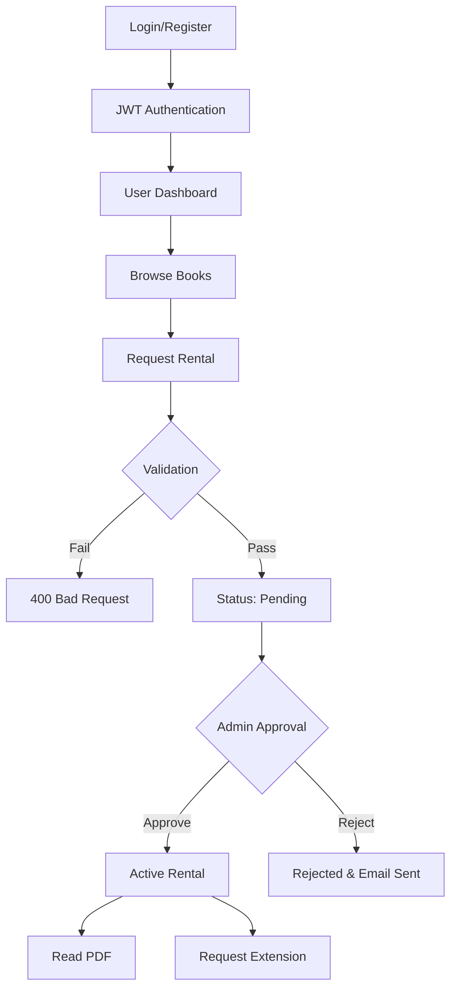

# Readify - Advanced Online Book Reading & Rental Platform

## 📌 Overview

**Readify** is a production-grade full-stack web application designed for managing a digital library. It features a robust **Book Management System**, a secure **Rental Workflow**, and an interactive **Reading Experience**.

The platform is built with a **Security-First** architecture, incorporating advanced protection layers like rate limiting, input sanitization, and strict validation to ensure data integrity and user safety.

---

## 🚀 Key Features

### 🛡️ **Advanced Security** (New!)
- **Rate Limiting**: Protects against Brute-Force and DDoS attacks.
    - **Auth Routes**: Max 10 attempts per 15 mins.
    - **API Routes**: Max 100 requests per 15 mins.
- **Input Sanitization**:
    - **NoSQL Injection**: Blocks malicious queries (removed `$` and `.`).
    - **XSS Protection**: Sanitizes HTML input to prevent script injection.
- **Strict Validation**:
    - **Joi Schemas**: Validates every single input field.
    - **Password Rules**: Enforces complex passwords (Min 6 chars, 1 Upper, 1 Lower, 1 Number).
    - **URL Params**: Validates MongoDB ObjectIDs to prevent server crashes.
- **Secure Headers**: Uses `Helmet.js` to set HTTP headers.

### 📚 **Core Functionalities**
- **User Authentication**: Secure Login/Register with JWT & Bcrypt.
- **Book Catalog**: Search, filter, and view book details.
- **Rental System**:
    - Request to rent books for specific hours.
    - Admin approval workflow.
    - Automatic expiry tracking.
    - Rental extension system.
- **PDF Reader**: Built-in viewer for reading rented books.
- **Interactions**: Rate and review books.
- **History**: Auto-tracking of reading progress.

### 📧 **Hybrid Email System**
- **Primary**: **Brevo API** (High deliverability).
- **Fallback**: **Nodemailer** (Gmail SMTP / OAuth2).
- **Notifications**:
    - New Book Alerts.
    - Rental Approvals/Rejections.
    - Extension Status Updates.

---

## 🏗️ Technical Architecture

### Tech Stack
- **Frontend**: Vanilla JS, CSS3, HTML5 (No framework, pure performance).
- **Backend**: Node.js, Express.js.
- **Database**: MongoDB Atlas (Mongoose ODM).
- **Security**: Joi, Helmet, XSS-Clean, Express-Rate-Limit, Express-Mongo-Sanitize.

### Workflow Diagrams

#### User Journey


### Folder Structure
```bash
readify_final/
├── backend/
│   ├── controllers/
│   │   ├── authController.js      # Register, Login logic
│   │   ├── bookController.js      # Book CRUD (Create, Read, Update, Delete)
│   │   ├── historyController.js   # User Reading History
│   │   ├── ratingController.js    # Book Rating logic
│   │   └── reviewController.js    # User Reviews logic
│   ├── middleware/
│   │   ├── adminMiddleware.js     # Admin role verification
│   │   ├── authMiddleware.js      # JWT Token verification
│   │   ├── errorMiddleware.js     # Global Error Handler (Sanitized 500s)
│   │   ├── rateLimiter.js         # Rate Limiting (DDoS Protection)
│   │   ├── validate.js            # Joi Request Validation
│   │   └── validateId.js          # MongoDB ObjectID Validation
│   ├── models/
│   │   ├── Book.js                # Book Schema
│   │   ├── History.js             # Reading History Schema
│   │   ├── Rating.js              # Rating Schema
│   │   ├── Rental.js              # Rental request/status Schema
│   │   ├── Review.js              # Review Schema
│   │   └── User.js                # User & Role Schema
│   ├── routes/
│   │   ├── authRoutes.js          # /api/auth
│   │   ├── bookRoutes.js          # /api/books
│   │   ├── historyRoutes.js       # /api/history
│   │   ├── ratingRoutes.js        # /api/ratings
│   │   ├── rentalRoutes.js        # /api/rentals
│   │   └── reviewRoutes.js        # /api/reviews
│   ├── utils/
│   │   ├── asyncHandler.js        # Wrapper for async routes (Try-Catch killer)
│   │   ├── emailService.js        # Brevo/Nodemailer Hybrid Service
│   │   └── validationSchemas.js   # Joi Validation Rules (Strict)
│   ├── uploads/                   # Stored PDF files
│   │   └── pdfs/
│   ├── .env                       # Environment Variables (Secrets)
│   ├── db.js                      # Database Connection Logic
│   ├── package.json               # Backend Dependencies
│   └── server.js                  # Main Server Entry Point
│
├── frontend/
│   ├── assets/                    # Images and Icons
│   ├── admin.html                 # Admin Dashboard UI
│   ├── admin.js                   # Admin Dashboard Logic
│   ├── config.js                  # API Base URL Config
│   ├── dashboard.html             # User Dashboard UI
│   ├── history.html               # Reading History UI
│   ├── history.js                 # Reading History Logic
│   ├── index.html                 # Landing Page
│   ├── login.html                 # Login Page
│   ├── login.js                   # Login Logic
│   ├── ratings.html               # Ratings UI
│   ├── reader.html                # PDF Reader UI
│   ├── reviews.html               # Reviews UI
│   ├── signup.html                # Signup Page
│   ├── signup.js                  # Signup Logic
│   └── style.css                  # Global Stylesheet
```

---

## 🔒 Security Implementation Details

### 1. Rate Limiting (`middleware/rateLimiter.js`)
We prevent abuse by throttling requests using `express-rate-limit`.
- **Auth Limiter**: Strict throttling on `/api/auth` to prevent password guessing.
- **API Limiter**: General throttling on content routes to prevent scraping.

### 2. Input Validation (`middleware/validate.js`)
All incoming data is validated against strict **Joi** schemas defined in `utils/validationSchemas.js`.
- **Example Rule**: Passwords must be `>6 chars` AND have `A-Z`, `a-z`, `0-9`.

### 3. Global Error Handling (`middleware/errorMiddleware.js`)
We replaced `try-catch` blocks with a wrapper `asyncHandler`.
- Catches all asynchronous errors.
- Returns a consistent JSON error format: `{ "error": "Message" }`.
- Prevents the server from crashing on unhandled exceptions.

### 4. Sanitization (`server.js`)
- `express-mongo-sanitize`: Strips keys containing `$`.
- `xss-clean`: Converts HTML characters to safe entities.

---

## 🛠️ Setup & Installation

### 1. Prerequisites
- Node.js (v16+)
- MongoDB Atlas Connection String
- Brevo API Key (Optional, for emails) or Gmail Credentials

### 2. Environment Variables
Create a `.env` file in `backend/`:
```env
PORT=5000
MONGO_URI=your_mongodb_connection_string
JWT_SECRET=your_jwt_secret
NODE_ENV=development

# Email Configuration
BREVO_API_KEY=your_brevo_key
EMAIL_USER=your_gmail_fallback
EMAIL_PASS=your_gmail_app_password
```

### 3. Install & Run
```bash
# Backend
cd backend
npm install
npm run dev

# Frontend
cd frontend
# Run using any static server (e.g., Live Server)
```

---

## 🧪 Testing the Security Layers

You can verify the security implementation with these tests:

1.  **Rate Limit Test**: Try logging in 11 times rapidly.
    - *Result*: `429 Too Many Requests`.
2.  **NoSQL Injection Test**: Send `{ "email": { "$gt": "" } }` to login.
    - *Result*: Sanitizer removes `$gt`, login fails safely.
3.  **XSS Test**: Send `<script>alert(1)</script>` as a book title.
    - *Result*: Saved as `&lt;script&gt;...` (harmless text).
4.  **Validation Test**: Try to signup with password "123".
    - *Result*: `400 Bad Request` ("Password must contain uppercase, lowercase...").

---

## 📝 API Documentation

| Method | Endpoint | Description | Security |
|--------|----------|-------------|----------|
| **POST** | `/api/auth/login` | User Login | RateLimit, Joi |
| **POST** | `/api/auth/register` | User Signup | RateLimit, Joi |
| **GET** | `/api/books` | List Books | RateLimit, Sanitized |
| **POST** | `/api/books` | Add Book (Admin) | Auth, Joi, Sanitized |
| **POST** | `/api/rentals/request` | Rent Book | Auth, Joi, ValidId |
| **PUT** | `/api/rentals/approve/:id` | Approve Rental | Auth, ValidId |

---

**Developed with ❤️ by the Readify Team**
